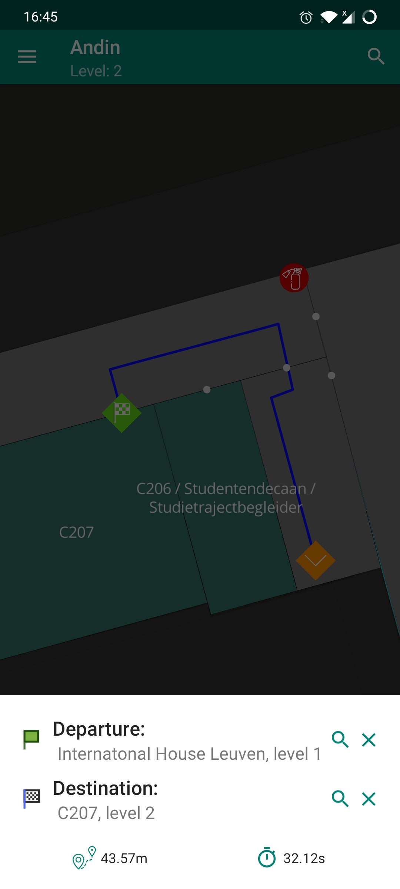

## Andin

*Indoor building viewing & navigation*

Andin helps you navigate complicated buildings by providing a map of the building's floors, a 3D view of it's rooms, and interactive navigation directions.

### Screenshots

Screenshot 1             |  Screenshot 2
:-------------------------:|:-------------------------:
  |  

### Source code

Andin is open source software, its code can be found on [https://github.com/ubipo/andin-android](https://github.com/ubipo/andin-android)

### Contact

Questions about the app? Email [pieter@pfiers.net](mailto:pieter@pfiers.net)

[https://pfiers.net](https://pfiers.net)
